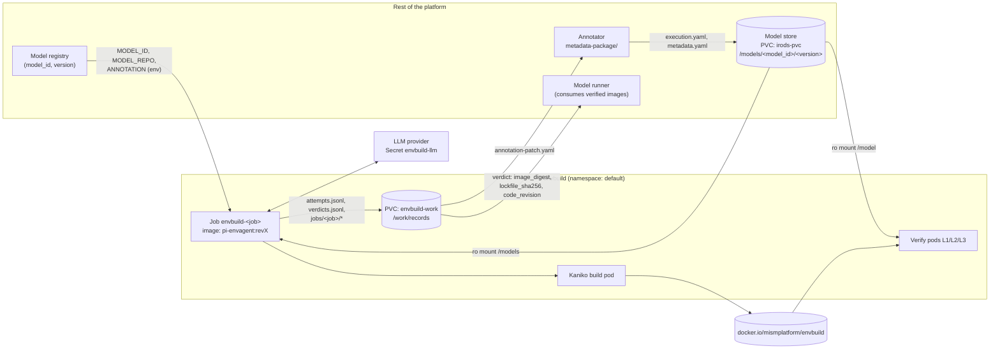
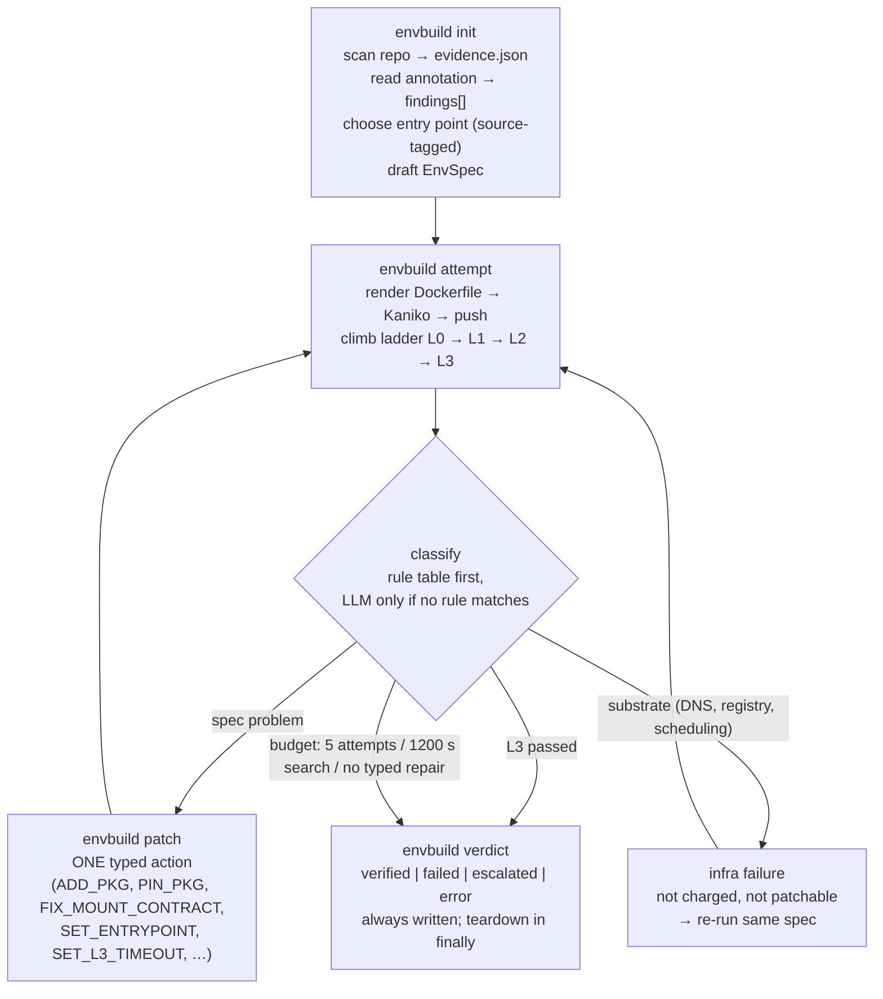
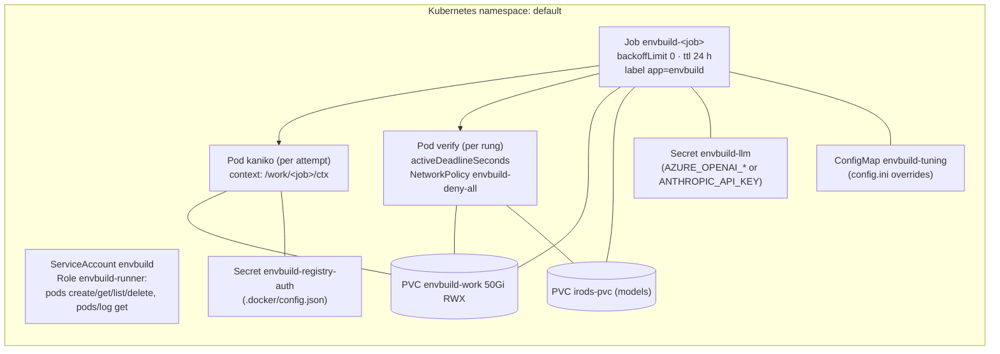

# envbuild — architecture and integration guide

*Living document. Diagrams are rendered from the Graphviz source in `docs/diagrams.py`; the Mermaid equivalents are in the appendix — edit either and re-render when a touch point moves.
Everything named here (env vars, paths, files, fields) is the real name in the repo as of rev 4.7.*

## 1. What envbuild is, in one paragraph

envbuild turns a **registered model** — a source repository plus its **annotation**
(`metadata-package/`) — into a **verified execution environment**: a container image, pinned by
digest, in which the example the repository itself ships has been run to completion. It does this
as a *search with verification*: an LLM agent proposes a structured build spec, deterministic code
builds it, a four-rung ladder verifies it, a rule table classifies whatever broke, one typed repair
is applied, and the loop repeats within a fixed budget. The product is not the Dockerfile; it is
the **record** — every attempt, every verdict, and every place the annotation was found wanting.

Three design decisions shape all the touch points below:

1. **The agent never writes Dockerfile text.** It emits an `EnvSpec` (a dataclass); rendering is
   deterministic and unit-tested. Every repair is a one-field mutation.
2. **Model code is mounted, not baked in** (default). The image is a *dependency stack*; the
   approval unit is the triple *(image digest, lockfile hash, code revision)*. A code change
   invalidates verification but not the build.
3. **The annotation is input and output.** Its execution fields are read as *suggestions with a
   source tag*; when the builder must deviate, it records a *proposal* (`annotation-patch.yaml`).
   It never edits the annotation.

## 2. System context


*System context — the five integration edges are numbered. (Confluence: attach `arch_1_system_context.png`.)*

**The five integration edges**, in the order a model flows through them:

| # | edge | direction | contract | where it is defined |
|---|---|---|---|---|
| 1 | registry → envbuild | in | three strings: `MODEL_ID`, `MODEL_REPO`, `ANNOTATION` | `deploy/agent-job.yaml` env; `run.sh` substitutes them |
| 2 | model store → envbuild | in | repo checked out at `/models/<model_id>/<version>` on a `ReadWriteMany` PVC | `config.ini [builder] models_pvc/models_mount` |
| 3 | annotator → envbuild | in | `metadata-package/execution.yaml` (+ `metadata.yaml`) | `src/evidence.py::read_annotation` (§5) |
| 4 | envbuild → runner | out | verdict row: `status`, `image_digest`, `lockfile_sha256`, `code_revision`, `entrypoint_used`, mount contract | `specs/record_schema.md`; `/work/records/verdicts.jsonl` |
| 5 | envbuild → annotator | out | `jobs/<job>/annotation-patch.yaml` — proposed field changes with evidence | `specs/success_criteria.md`; `src/driver.py::write_annotation_patch` |

## 3. Inside one job


*Inside one job — the search loop and the verification ladder. (Confluence: attach `arch_2_job_loop.png`.)*

The **agent** (an LLM running the `SKILL.md` procedure inside the Job container) does exactly two
things a model is needed for: synthesise the first spec and pick a repair when the rule table has
nothing to say. Everything else — budgets, forbidden repeated repairs, retain-best-so-far,
one-action-per-attempt, verdict-on-every-exit — is enforced by `src/driver.py`, not by the prompt.

### The verification ladder

| rung | runs | proves | failure is attributed to |
|---|---|---|---|
| L0 | Kaniko | image builds and pushes; digest recorded | the spec (`failed_step_index` names the `EnvSpec` field) |
| L1 | image **alone** | every declared dependency imports; a **lockfile** of installed distributions is read from inside the image | the image — unambiguously ours |
| L2 | image + code mounted | the entry script exists, its imports resolve | mount contract or code |
| L3 | image + code + `/outputs` | the example runs to completion within `l3_timeout_s` and writes where the annotation says | runtime |
| L4 | — | output matches a reference trace | *schema only; never run in Phase 0* |

L1/L2 is the boundary that matters: an L1 failure can never be the model's fault.

### Mount contract (what the model sees at L2/L3)

```
/model      ← MODEL_REPO, read-only            (mount.code_path)
/inputs     ← empty, read-only                 (mount.input_path)
/outputs    ← writable, harvested as outputs   (mount.output_path)
cwd         = mount.workdir  (default /model; derived from the entry script's dir when it reads relative files)
PYTHONPATH / R_LIBS += mount.extra_path
env:  ENVBUILD_INPUTS, ENVBUILD_OUTPUTS   (the model may read these instead of hard-coding paths)
network: none
```

Two escape hatches for models that do not respect this: `mount.writable_copy=true` (L3 runs in a
writable copy of the code; new files are harvested back into `/outputs`) and
`install_mode=installed` (code baked into the image with `COPY . /model`; used when the README
installs the project, or when the framework discovers plugins over installed distributions).
**A runner that consumes a verified image must reproduce this contract** — same paths, same env
vars, same install mode — or the verification does not transfer.

## 4. Deployment shape


*Deployment — every Kubernetes object envbuild owns. (Confluence: attach `arch_3_deployment.png`.)*

All envbuild-owned objects are named `envbuild-*` and labelled `app=envbuild`; the namespace is
shared with the rest of the platform, so **only those objects are ever created or deleted**.
Manifests: `deploy/envbuild.yaml` (SA, Role, RoleBinding, PVC, NetworkPolicy — apply once) and
`deploy/agent-job.yaml` (one Job per model; placeholders below).

### Launching a job — the only thing a caller needs

```bash
# run.sh substitutes these into deploy/agent-job.yaml and applies it
__JOB__          unique job name          e.g. 20260924-080348-vivarium-chemotaxis
__MODEL_ID__     registry id              e.g. mism:model/mbmm        (recorded on every row)
__MODEL_REPO__   path on the models PVC   e.g. /models/mbmm/1.0
__ANNOTATION__   metadata-package dir     e.g. /models/mbmm/1.0/metadata-package
__MODELS_PVC__   PVC holding the repos    e.g. irods-pvc
__AGENT_IMAGE__  harness image by digest  e.g. mismplatform/pi-envagent:rev4.7@sha256:…
__RUN_ID__       batch label              e.g. aks-rev4-8            (recorded on every row)
```

Completion is the Job's `.status.succeeded`; the verdict row is the result. `kubectl apply
--dry-run=server` validates a rendered manifest without creating anything.

## 5. Annotation touch points (edge 3 and edge 5)

### What envbuild reads — `metadata-package/execution.yaml`

| annotation field | how envbuild uses it | if wrong / missing |
|---|---|---|
| `execution.language.name`, `.version` | base image selection (`specs/base_selection.md`) | evidence from the repo wins (`pyproject requires-python`, `renv.lock`, …) |
| `execution.dependencies` (runtime + system) | initial `pkg_specs` / `apt_packages` | a repo lockfile pins over it; non-package entries (`GAMA Platform1.8`) are dropped with a finding |
| `execution.entry_points[].command`, `.arguments` | **the L3 command** (first usable entry) | cross-checked against what the repo documents; an unusable entry is replaced by the repo's own smoke example and recorded as a correction |
| `execution.entry_points[].default_output_location` | whether L3 asserts files were written | if absent, L3 claims only "ran clean" |
| `execution.compute.typical_runtime {value, unit}` | **L3 deadline** (×1.5 + 60 s, capped at `l3_timeout_max_s`) — *wired in rev 4.7* | 600 s default; the agent may extend once via `SET_L3_TIMEOUT` |
| `execution.compute.gpu_required`, `memory_gb` | *not yet read* | — |
| `io.inputs`, `io.outputs` | recorded; `expected_outputs` informs the output check | — |

Every field read is a **suggestion**: `evidence.json` records the repo's own facts alongside, and
`init` emits `annotation_findings[]` (`not_a_command`, `file_missing`, `placeholder_args`,
`needs_workdir`, `unsupported_tool_dependency`, `undeclared_imports`, `lockfile_honoured`, …).

### What envbuild gives back — `jobs/<job>/annotation-patch.yaml`

```yaml
annotation_patch:
  schema: envbuild-annotation-patch/1
  model_id: bench:circadian-clock
  job_id: job-2026-09-22-7bbe
  code_revision: <git sha>
  source: /models/.../metadata-package
  changes:
    - field: mount.workdir                      # or entry_points[0].command,
      was: /model                               #    entry_points[0].expected_runtime_s
      now: /model/biomodels/coreClock
      evidence: "run_clock_model.py opens files relative to biomodels/coreClock/"
      outcome: verified                         # only verified | helped reach the patch
```

Only corrections that a passing rung *accepted* reach this file; rejected guesses stay on the
verdict row as data. **The annotator's integration is: consume this file, decide, re-annotate.**
The builder will never write to `metadata-package/`.

## 6. Record touch points (edge 4)

All records are JSONL on `envbuild-work:/work/records/`; the schema is `specs/record_schema.md`
and `src/record.py` refuses to write a row missing a required key.

**`verdicts.jsonl`** — one row per job; the fields a consumer needs:

| field | meaning |
|---|---|
| `model_id`, `code_revision`, `run.run_id`, `run.harness_image` | what was built, by which harness |
| `status` | `verified` · `failed` (budget) · `escalated` (no typed repair) · `error` (substrate) · `budget_exhausted` |
| `ladder_reached` | highest rung passed |
| `image_digest`, `lockfile_sha256`, `envspec_hash` | **the approval unit** — pin all three |
| `entrypoint_used`, `entrypoint_source` | the L3 command and whether it came from `annotation`, `repo`, or a `SET_ENTRYPOINT` |
| `annotation_corrections[]` | every deviation from the annotation with `outcome` |
| `charged_attempts`, `infra_retries`, `search_seconds`, `l3_seconds` | cost, separated into search vs model runtime vs substrate |

**`attempts.jsonl`** — one row per attempt: `envspec`, rendered `dockerfile`, `failed_rung`,
`failed_step_index`, `failure_class`, `classified_by` (`rule`/`llm`), `classifier_rule`,
`action_taken`, decoded `error_raw`, `charged`. This is the dataset the benchmark scores and the
input for any future cross-job memory.

**Per job** under `jobs/<job>/`: `state.json`, `evidence.json`, `Dockerfile.aN`, `lockfile.aN.txt`,
`annotation-patch.yaml`.

**Image naming**: `docker.io/mismplatform/envbuild:<job>-a<N>` (flat registry layout); the
verdict's `image_digest` is what to pull by. OCI labels on every image: `io.envbuild.model_id`,
`io.envbuild.code_revision`, `io.envbuild.run_id`, `io.envbuild.schema`.

## 7. Configuration and secrets

| what | where | notes |
|---|---|---|
| budgets: `max_attempts 5`, `wall_clock_s 1200` (search time only), `build_timeout_s 600`, `verify_timeout_s 300`, `l3_timeout_s 600`, `l3_timeout_max_s 1800`, `max_infra_retries 2` | `config.ini [budgets]`; override via ConfigMap `envbuild-tuning` | wall clock excludes infra time and L3 run time |
| cluster: namespace, PVC names/mounts, Kaniko image, registry, `flat_registry` | `config.ini [builder]` / env `ENVBUILD_*` | in-cluster token is picked up automatically |
| LLM: `AZURE_OPENAI_BASE_URL`+`AZURE_OPENAI_API_KEY` **or** `ANTHROPIC_API_KEY`; `AI_MODEL`, `AI_PROVIDER` | Secret `envbuild-llm` | provider inferred from which key is present |
| registry push | Secret `envbuild-registry-auth` (`.docker/config.json`) | mounted into Kaniko |
| run provenance: `run_id`, `harness_image`, `agent_model` | env `ENVBUILD_RUN_ID`, `ENVBUILD_HARNESS_IMAGE`, `AI_MODEL` | stamped on every row |

## 8. Trust boundary — read before pointing this at a new source

Verify pods **execute model code**. They run with no network, a read-only code mount, and a pod
deadline — and no further sandbox. Phase 0 is for **trusted repositories only**. The build pod
(Kaniko) has network for package installs; the agent container has network for the LLM and the
Kubernetes API (scoped by Role `envbuild-runner` to pods in one namespace).

## 9. Code map

```
envagent/
  SKILL.md                 the agent's procedure (what the LLM reads)
  config.ini               budgets, cluster, registry
  deploy/envbuild.yaml     SA, Role, PVC, NetworkPolicy (apply once)
  deploy/agent-job.yaml    Job template (one per model)
  run.sh                   substitutes placeholders, applies the Job
  harness/entrypoint.sh    container entry: credentials → pi → resume on stream drop
  src/driver.py            CLI + loop invariants + budgets + verdict          ← integration: init/attempt/patch/verdict
  src/evidence.py          repo scan; read_annotation; lockfile; undeclared imports  ← integration: annotation in
  src/examples.py          what the repo says to run; annotation cross-check
  src/baseselect.py        base image / install mode selection
  src/envspec.py           EnvSpec dataclass; deterministic Dockerfile renderer
  src/builder.py, k8s.py   Kaniko build pod; image naming; digest
  src/verifier.py          verify pods; mount contract; log capture
  src/ladder.py            L0–L3; lockfile probe; writable-copy harvest
  src/classify.py          rule table → failure_class + typed action; LLM fallback
  src/patch.py             the typed actions and their guards
  src/record.py            row schemas (required keys)                     ← integration: records out
  specs/*.md               the design contracts each module implements
  bench/ground_truth.yaml  what "success" means per benchmark model
  scripts/test_envbuild.py 145 offline checks — run before every image build
  scripts/score.py         benchmark scoring against ground truth
  scripts/reclassify.py    replay the rule table over historical rows
```

## 10. Open integration items

1. **Runner contract**: the model runner must apply the verdict's mount contract (`/model`,
   `/inputs`, `/outputs`, `workdir`, `install_mode`, `writable_copy`) — not yet written down on the
   runner side.
2. **Annotation write-back**: nothing yet consumes `annotation-patch.yaml`.
3. **Compute hints**: `compute.gpu_required` / `memory_gb` are annotated but unread; verify pods
   get default resources.
4. **Cross-job memory**: `error_signature` is recorded on every attempt but not yet looked up
   across jobs.
5. **L4**: reference-trace comparison needs an output-schema agreement with the annotator.

## Appendix — diagram source (Mermaid)

Kept so the diagrams can be regenerated or edited in any Mermaid-capable tool.

### System context — the five integration edges are numbered



### Inside one job — the search loop and the verification ladder



### Deployment — every Kubernetes object envbuild owns


